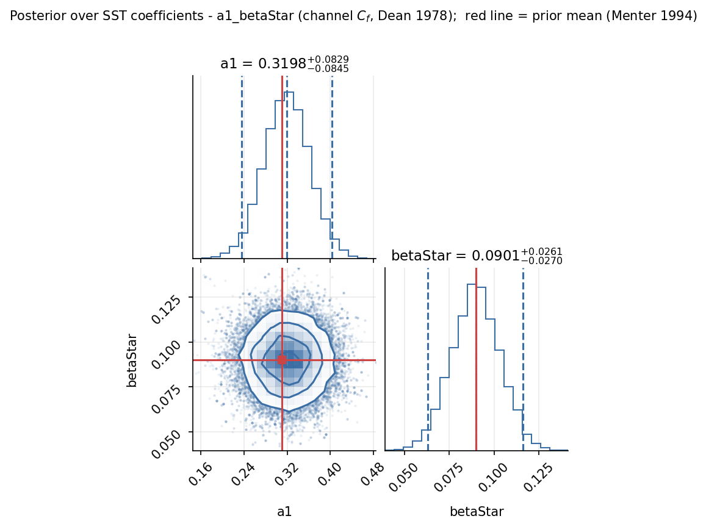
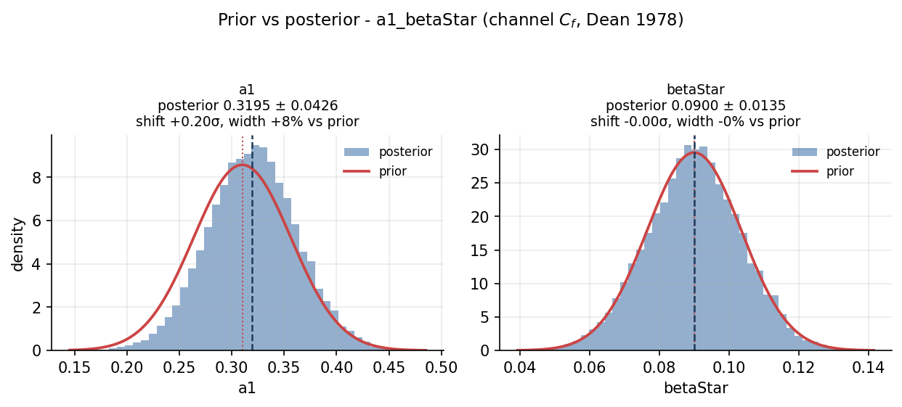
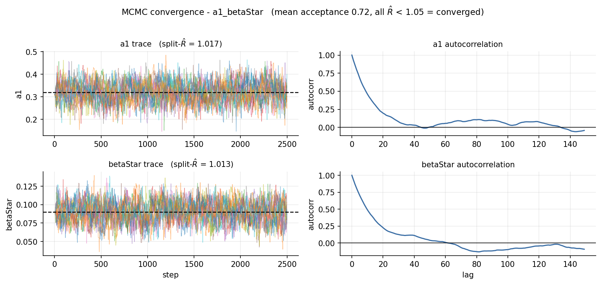
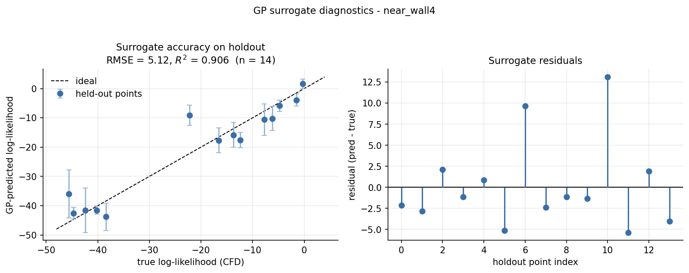
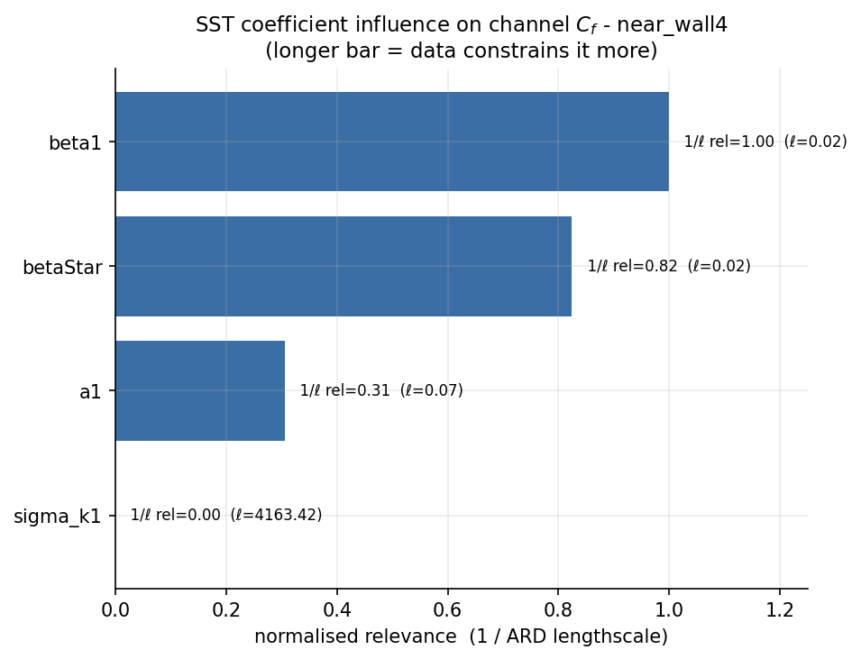
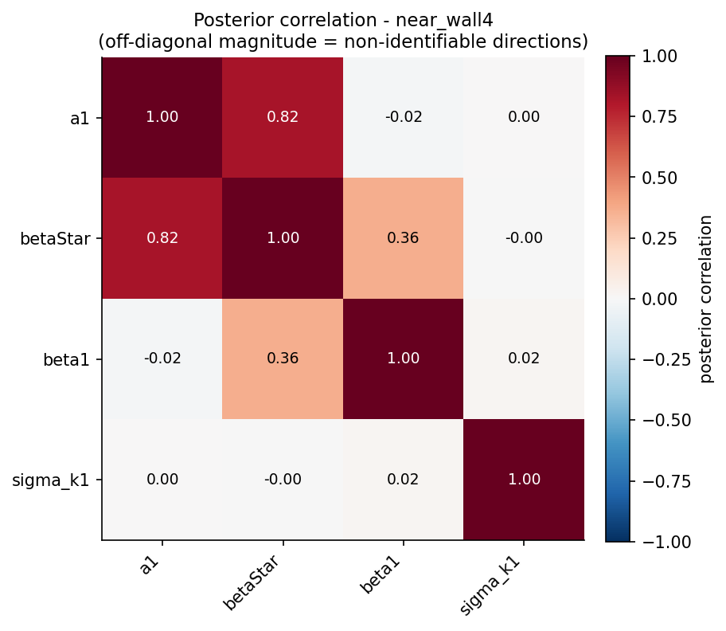
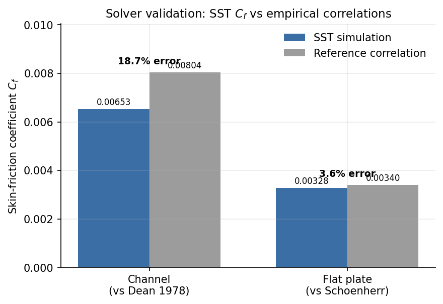
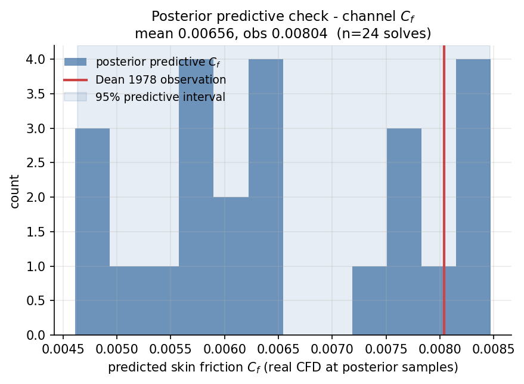

# Bayesian Calibration of RANS Turbulence Models

RANS turbulence models underpin the vast majority of production CFD, yet their
closure coefficients are empirical constants tuned decades ago for generic flow
classes. Applied to a specific configuration (a particular geometry,
Reynolds-number regime, or separation-dominated flow), these defaults can
introduce systematic prediction error with no indication of how wrong they might
be. This project replaces that single-point-estimate practice with a statistical
one. Given experimental or DNS observations of a flow, it infers a full posterior
distribution over the SST k-omega closure coefficients, producing calibrated
values together with quantified uncertainty. The result is not merely a better set
of constants, but a measure of how strongly the data constrains each one and which
combinations the data can resolve at all.

## Motivation

Re-tuning closure coefficients to a new dataset is standard practice, and it
returns one value for each coefficient. That single value omits three quantities
that govern whether a calibration can be trusted: how tightly the data constrains
each coefficient, whether coefficients trade off so that only a combination is
determined, and how much predictive uncertainty remains afterward. A posterior
distribution recovers all three. A coefficient the data informs moves away from
its prior and narrows. A coefficient the data cannot see remains at its prior.
Coefficients that compensate for one another appear as correlations in the joint
distribution.

Bayesian calibration of turbulence-model coefficients is itself well established
(Edeling et al., 2014). Surrogate-accelerated implementations, however, carry
recurring weaknesses that this work targets directly. A Gaussian-process surrogate
fitted to a deterministic solver tends toward an interpolating, overconfident
posterior unless its predictive variance is controlled, so the surrogate here is
given a noise floor and its accuracy is reported on held-out solves rather than
assumed. The directions of coefficient space that the data actually constrains are
often left implicit, so this implementation measures identifiability and
sensitivity and reports them. Parameter uncertainty and model-form error are
easily conflated, so a Kennedy-O'Hagan discrepancy term separates the two, and a
posterior predictive check run on the real solver exposes the model-form residual
that no choice of coefficients can remove. The contribution is not the Bayesian
formulation, which is standard, but the discipline applied to keep its uncertainty
estimates honest.

## Theory

Reynolds-averaging the Navier-Stokes equations leaves the Reynolds-stress tensor
unclosed. The SST model closes it through the Boussinesq hypothesis, aligning the
stress with the mean strain rate and scaling it by a single eddy viscosity whose
transport is governed by eleven empirical coefficients (Menter, 1994). Calibration
asks which coefficient values are consistent with measured observables, a question
Bayes' rule answers directly.

```
p(θ | data) ∝ p(data | θ) · p(θ)
```

The prior `p(θ)` is a truncated normal centred on the Menter defaults and clipped
to the region where the solver remains stable and the closure remains realizable.
The likelihood `p(data | θ)` compares solver output to measurements under Gaussian
observation noise. Each likelihood evaluation requires a full CFD solve, which
makes direct sampling of the posterior intractable. The solver is therefore
emulated through the following stages.

1. **Ensemble.** Latin-hypercube coefficient vectors spanning the prior support
   are evaluated by the solver. Each returns a set of observables and a Gaussian
   log-likelihood. Solves that diverge or fail to converge are classified and
   excluded.
2. **Surrogate.** A Gaussian process with an automatic-relevance-determination
   (ARD) RBF kernel is fitted to the surviving coefficient-likelihood pairs. A
   noise floor prevents the variance collapse that would otherwise render the
   surrogate overconfident. The per-coefficient lengthscales serve as a relevance
   measure.
3. **Sampling.** The affine-invariant ensemble sampler emcee draws from the
   posterior using the surrogate in place of the solver. A No-U-Turn sampler
   provides a gradient-based alternative, driven by the analytic surrogate
   gradient that the implementation verifies against finite differences.
4. **Diagnostics.** Autocorrelation time, effective sample size, acceptance
   fraction, and split-R-hat establish that the chain has mixed.
5. **Analysis.** The posterior yields credible intervals and a shift-from-prior
   for each coefficient, an identifiability spectrum and a sensitivity ranking,
   model evidence and Bayes factors for comparing closure variants, and posterior
   predictive checks that return the real solver to the loop. A multi-fidelity
   mode fuses observations of differing resolution, and the Kennedy-O'Hagan
   discrepancy term represents model-form error explicitly.

## Results

The results below come from calibrating against turbulent channel-flow skin
friction at `Re_b = 6800` under two configurations. A two-coefficient case (`a1`
and `β*`) isolates the posterior cleanly, and a four-coefficient case (adding
`β1` and `σ_k1`) exposes the sensitivity and identifiability structure.

### A posterior, not a point estimate



The joint and marginal posteriors for `a1` and `β*` settle at `a1 = 0.319 ± 0.043`
and `β* = 0.090 ± 0.014`, with the Menter prior mean indicated in red. The joint
distribution is close to isotropic, which indicates that the two coefficients are
nearly uncorrelated under this observable. These marginals are the basis for the
analysis that follows.

### What the data constrains



Overlaying each prior on its posterior distinguishes the informed coefficient from
the uninformed one. `a1` shifts from its prior and narrows, so the channel skin
friction constrains it to a degree. `β*` coincides with its prior, meaning the
observable carries no information about it. A single-point calibration would have
reported a definite value of `β*` that the data never supported.

### Sampling convergence



The walker traces and autocorrelation confirm a converged chain. Split-R-hat is
1.02 for both coefficients, and the run yields approximately 1,500 effective
samples from 48,000 draws at an acceptance fraction of 0.72.

### Surrogate fidelity and acceleration



Predicted against true log-likelihood on held-out solves, the Gaussian-process
surrogate attains `R² = 0.91` across the sampling region. This fidelity is what
permits the acceleration. A likelihood query costs roughly a ten-thousandth of a
second on the surrogate against approximately eighteen seconds for the solver, a
factor of about 176,000, which reduces a sampling run of nominally two weeks to a
few seconds. The same held-out diagnostic also marks the method's boundary.
Extended across the full prior box, the surrogate loses fidelity in the sparse
low-likelihood tails, which is the reason sampling is confined to the narrowed
region.

### Coefficient sensitivity



Ranking the four coefficients by their ARD lengthscales converts the fit into a
sensitivity measure. `β1`, `β*`, and `a1` register as influential, while `σ_k1`
is inert, its lengthscale four to five orders of magnitude longer than the others.
The channel skin friction does not depend on the k-equation diffusion coefficient,
so this observable cannot calibrate it at any sample size.

### Joint identifiability



The posterior correlation matrix completes the picture. `a1` and `β*` correlate at
0.82, meaning a single skin-friction measurement constrains a combination of the
two rather than either independently, and leaves a ridge in the `(a1, β*)` plane.
`σ_k1`, consistent with its negligible sensitivity, is uncorrelated with the
others. This joint structure determines whether a calibration is well posed and is
invisible to a point estimate.

## Validation and interpretation

### Validation against reference correlations



Calibration is meaningful only if the underlying solver is sound. On a flat-plate
boundary layer the solver reproduces the Schoenherr skin-friction correlation to
3.6%. On channel flow it predicts 18.7% below Dean's correlation, within the
solver's acceptance band but a substantial margin, and consistent with the known
under-prediction of channel `Cf` by two-equation models on a coarse near-wall
mesh. The low-Mach compressible path is pinned to a committed regression baseline,
in which the `Ma = 0.1` channel converges in 494 SIMPLE iterations with a
mass-flux imbalance of 8.8e-5 and reproduces its skin friction to within 5%.

### Posterior predictive check



The end-to-end test returns the solver to the loop, re-running it at a sample of
posterior draws and comparing the resulting distribution of skin friction to the
observation used for calibration. The predictive mean is 0.00656 against the Dean
target of 0.00804, and the observation falls inside the 95% predictive interval
but at its upper edge. The calibrated coefficients are therefore statistically
consistent with the measurement while remaining biased low by roughly the margin
seen in the raw validation. Adjusting `a1` and `β*` reduces the discrepancy
without eliminating it, because the residual is model-form rather than parametric,
which is the condition the Kennedy-O'Hagan term is designed to represent.

## Repository layout

```
core/            mesh, fields, linear solvers, the SST closure, the observation
                 operator, and inference parameter sets (the physics-agnostic core)
incompressible/  the incompressible SIMPLE solver, forward model, and
                 parameter-sensitivity machinery
compressible/    the low-Mach compressible SIMPLE solver and forward model
include/, src/   an earlier flat header and source layout retained alongside the
                 layered modules above
python/          the inference layer: priors, Latin hypercube sampling, the GP
                 surrogate, emcee, NUTS, Kennedy-O'Hagan, identifiability,
                 sensitivity, model evidence, and multi-fidelity fusion, with the
                 pybind11 bindings and runnable examples
viz/             scripts that regenerate every figure in this README from solver
                 and inference output
tests/           C++ (ctest) and Python (pytest) tests, fixtures, regression data
data/            a provenance manifest, with the datasets themselves kept local
scripts/         build, test, and reproduce entrypoints
docs/            project notes and documentation
CMakeLists.txt   builds the static libraries, both solver CLIs, and the Python module
```

## Build and run

The prerequisites are a C++17 compiler (GCC 9+, Clang 10+, or Apple Clang), CMake
3.14 or newer, and Python 3.11 with numpy, scipy, matplotlib, emcee, GPy, corner,
and multiprocess. CMake fetches pybind11 on its own. The binding is compiled for
whichever interpreter CMake selects, so a single Python should be used throughout.

Build the libraries, both solver CLIs, and the Python module.

```bash
cmake -S . -B build -DBUILD_PYTHON_BINDINGS=ON
cmake --build build -j
```

Check the solver against its built-in validations.

```bash
./build/rans_sst --validate-channel   # channel flow vs Dean
./build/rans_sst --validate-plate     # flat plate vs Schoenherr
./build/rans_sst --all
```

Run a calibration end to end.

```bash
PYTHONPATH=build:python python3 python/examples/channel_flow_example.py --demo
```

Run the tests (462 Python, 2 C++) through the canonical entrypoint.

```bash
scripts/run_tests.sh
```

Regenerate the figures above from solver and inference output.

```bash
export PYTHONPATH=build:python
python3 viz/run_cpp_validation.py
python3 viz/run_calibration.py a1_betaStar
python3 viz/run_calibration.py near_wall4
python3 viz/run_surrogate_benchmark.py
python3 viz/make_all_figures.py
```
