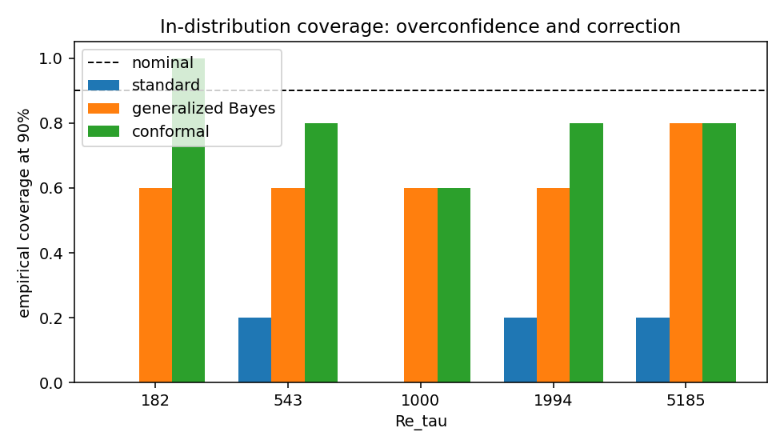
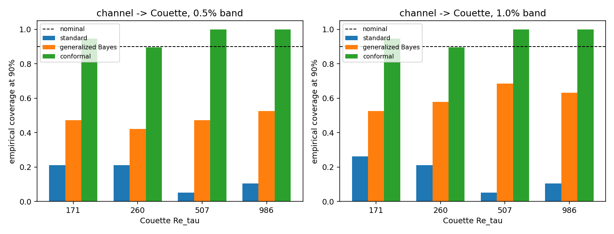
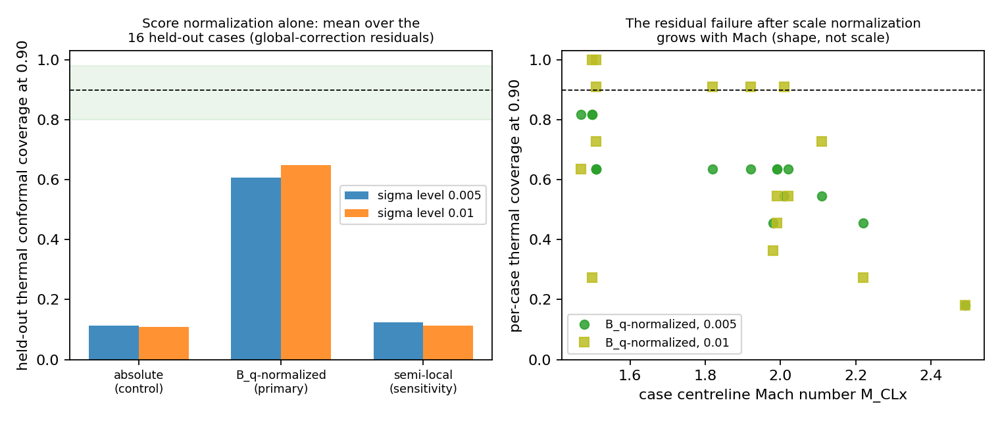

# Bayesian Uncertainty Quantification for RANS Turbulence Models

## Introduction

Reynolds-averaged Navier-Stokes (RANS) models reduce the cost of turbulent-flow
simulation by replacing unresolved turbulent stresses with an approximate
closure. The resulting model-form error depends on the flow regime and may not
be represented by uncertainty in the closure coefficients alone. Bayesian
calibration can therefore produce a concentrated posterior while its predictive
intervals remain systematically too narrow under changes in Reynolds number,
geometry, Mach number, or flow type.

The objective of this work is to distinguish parameter uncertainty from
structural closure error and to quantify how predictive calibration changes
under distribution shift. C++ CFD solvers implemented in this repository are
coupled to Python methods for Bayesian inference, Gaussian-process emulation,
conditional density estimation, and conformal calibration. The studies span
attached incompressible flows, separated flows, high-speed heat transfer, and
shock-boundary-layer interaction. Predictions are assessed against independent
direct numerical simulation (DNS) data.

## Methodology

### Statistical formulation

A RANS prediction can be written as

$$
y(x) = G(x,\theta) + \delta(x) + \varepsilon,
$$

where $G$ denotes the CFD forward model, $\theta$ contains turbulence-model
parameters, $\delta$ represents systematic model discrepancy, and $\varepsilon$
is observation error. Standard Bayesian calibration updates the parameter
distribution according to

$$
p(\theta \mid D) \propto p(D \mid \theta) p(\theta).
$$

When model discrepancy is omitted or inadequately represented, additional data
can contract the posterior around a biased approximation. Generalized Bayes
reduces this contraction through a learning rate $\eta$:

$$
p_\eta(\theta \mid D) \propto p(D \mid \theta)^\eta p(\theta),
\qquad 0 < \eta \leq 1.
$$

The learning rate is estimated by moment matching on reserved calibration data,
without reference to the evaluated test observations.

### Surrogate and discrepancy models

Ensembles of CFD solutions provide training data for Gaussian-process surrogates
of the likelihood and predicted quantities. The surrogates replace repeated CFD
evaluations during posterior sampling while retaining predictive variance.

For model-form inference, the target is the discrepancy between the DNS and RANS
Reynolds-stress anisotropy tensors,

$$
\Delta \mathbf{b}(x) =
\mathbf{b}_{\mathrm{DNS}}(x) - \mathbf{b}_{\mathrm{RANS}}(x).
$$

Gaussian models and conditional normalizing flows approximate the conditional
law $p(\Delta \mathbf{b} \mid \boldsymbol{\phi})$, where
$\boldsymbol{\phi}$ contains local flow features. The normalizing-flow model
permits correlated, non-Gaussian stress discrepancies beyond a Gaussian
conditional baseline. Coherent samples are propagated through the CFD solver
under a realizability constraint, allowing the uncertainty model to be evaluated
on mean-flow and wall quantities rather than only on stress reconstruction.

### Predictive calibration

Split-conformal calibration estimates interval width from residuals on reserved
calibration data. For prediction $\hat y_i$ and scale $w_i$, the calibration score
is

$$
s_i = \frac{|y_i - \hat y_i|}{w_i}, \qquad
q = Q_{1-\alpha}(s_1,\ldots,s_n).
$$

Here, $Q_{1-\alpha}$ is the empirical quantile of the reserved calibration
scores. The corresponding predictive interval is

$$
C_{1-\alpha}(x) =
[\hat y(x) - q w(x), \quad \hat y(x) + q w(x)].
$$

The unscaled score uses $w=1$; the high-speed study also considers a
physics-based scale derived from predicted wall heat flux. Conformal calibration
changes the interval width but not the mean CFD prediction.

### Evaluation protocol

Study designs use separate fitting, calibration, and testing roles. Test cases do
not enter model fitting, learning-rate selection, or conformal calibration. For
$N$ test observations, empirical coverage of a nominal $(1-\alpha)$ interval is

$$
\widehat{c}_{1-\alpha} =
\frac{1}{N}\sum_{j=1}^{N}
\mathbf{1}[y_j \in C_{1-\alpha}(x_j)].
$$

Predictive performance is evaluated jointly through coverage, interval sharpness,
continuous ranked probability score, and energy score. Only converged solver
members enter reported statistics, and propagated stress corrections are checked
for physical realizability. Study-specific protocols, fixed seeds, deviations,
and machine-readable results are retained with each evidence package.

## Results

### Predictive coverage under distribution shift

Standard Bayesian intervals undercovered in each attached-flow evaluation
summarized below. Generalized Bayes and split conformal moved coverage toward the
nominal level, although the extent of recovery depended on the distribution
shift.

| Evaluation | Standard Bayes | Generalized Bayes | Split conformal |
|---|---:|---:|---:|
| Channel to unseen Couette flow, four Reynolds numbers | 5.3% to 21.1% | 42.1% to 52.6% | **89.5% to 100%** |
| Held-out channel locations, five Reynolds numbers | 0% to 20% | 60% to 80% | **80% pooled** |
| Channel transfer to an unseen Reynolds number | 9.5% to 33.3% | 81.0% to 95.2% | **90.5% to 100%** |

For cross-flow transfer, the posterior was trained on plane-channel data and
propagated through an independent Couette-flow solver. Standard Bayesian
intervals contained 1 to 4 of 19 DNS targets per case, corresponding to 5.3% to
21.1% coverage. Split conformal used residuals from a reserved channel case and
contained 17 to 19 targets, corresponding to 89.5% to 100% coverage. No Couette
data were used for fitting or calibration. Generalized Bayes improved coverage
but remained below nominal. On held-out locations within the channel cases,
pooled conformal coverage reached 80%, so restoration was incomplete under that
evaluation.

<p align="center">
  
  
</p>
<p align="center"><sub>Held-out channel locations (left) and channel-to-Couette transfer (right). The dashed line marks the nominal 90% target.</sub></p>

Complete protocols and corrected numbers are in the
[channel finding](UQ-RANS_research/step1_plane_channel/channel_finding.md) and
[Couette finding](UQ-RANS_research/step2_couette/couette_finding.md).

### High-speed heat transfer

Across two observation-noise settings, normalizing conformal residuals by
predicted wall heat flux increased held-out thermal coverage from 11.4% to 60.8%
and from 10.8% to 64.8%, without model refitting. Coverage remained below the
nominal 90%, indicating that wall-flux scale explains a substantial component of
the transfer error but not its Mach-dependent shape.

<p align="center">
  
</p>

See the [heat-flux finding](UQ-RANS_research/heatflux_modelform/heatflux_modelform_finding.md)
for the registered test and complete results.

### Separated flows

Conditional normalizing flows were compared with Gaussian and standard
stress-perturbation baselines. In the corrected periodic-hills study, every
available 90% reattachment interval excluded the DNS value. All converged
corrections remained realizable, but the coupled response was too small. Because
the current injection changes stress anisotropy without correcting turbulence
energy, the modeled energy limits the achievable change in the mean flow.

See the [separated-flow finding](UQ-RANS_research/separated_modelform/hills_crossgeom_finding.md).

## Ongoing study

The current study extends the framework to shock and turbulent-boundary-layer
interaction. The coupled solver campaign is ongoing, and no coupled result is
reported here. The evaluation protocol was fixed in advance in the
[shock-interaction pre-registration](UQ-RANS_research/shock_interaction/PRE_REGISTRATION.md).

## Software and reproducibility

The numerical implementation comprises four C++ components developed as part of
the project:

- [incompressible/](incompressible/) contains the SIMPLE RANS solver used for
  channel, Couette, and separated-flow studies.
- [compressible/](compressible/) contains the low-Mach compressible SIMPLE solver.
- [dbns/](dbns/) contains the density-based, shock-capturing solver library.
- [core/](core/) contains meshes, fields, linear solvers, and the SST closure
  shared by the flow solvers.

The Python layer provides:

- Gaussian-process surrogates and Bayesian sampling;
- generalized Bayes and split-conformal calibration;
- conditional normalizing flows and Gaussian discrepancy baselines;
- fixed-seed evaluation, scoring, and figure generation.

Curated evidence lives in [UQ-RANS_research/](UQ-RANS_research/). Each completed
study includes a finding memo, machine-readable numbers, and selected figures.
Large solver caches and third-party DNS fields are not committed. Dataset
attribution and provenance are recorded in the
[research archive](UQ-RANS_research/README.md).

## Build and test

Use one Python 3.11 interpreter for installation, CMake, and tests. The project
pins NumPy 1.25.2 because newer releases are incompatible with the validated GPy
stack.

```bash
# Reference macOS interpreter; replace with your Python 3.11 path.
QBTM_PYTHON=/Library/Frameworks/Python.framework/Versions/3.11/bin/python3

"$QBTM_PYTHON" -m pip install -r requirements.txt
cmake -S . -B build -DBUILD_PYTHON_BINDINGS=ON \
  -DPython_EXECUTABLE="$QBTM_PYTHON"
cmake --build build -j
ctest --test-dir build --output-on-failure
PYTHONPATH=build:python "$QBTM_PYTHON" -m pytest
```

The normalizing-flow studies also require PyTorch 2.10.0. Reproduction drivers
are under [python/UQ/](python/UQ/) and use fixed seeds. The full studies require
the local DNS datasets and can be computationally expensive; each finding memo
names its driver and exact protocol.
